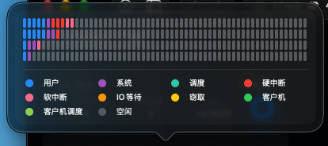

# ChartUI
SwiftUI ChartUI

```swift
.package(url: "https://github.com/foxterm/ChartUI.git", .upToNextMinor(from: "1.0.0")),
```
```swift
.product(name: "ChartUI", package: "ChartUI"),
```
# Demo



